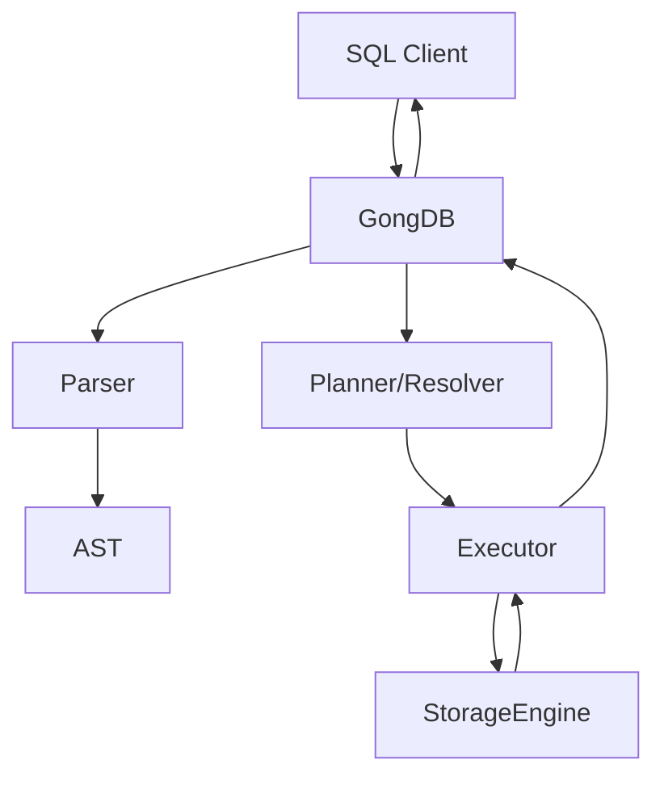
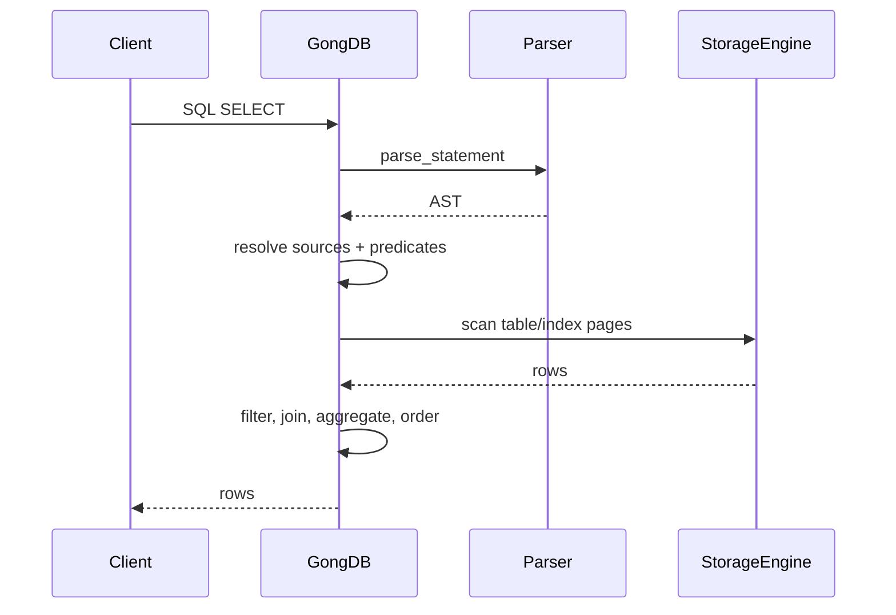
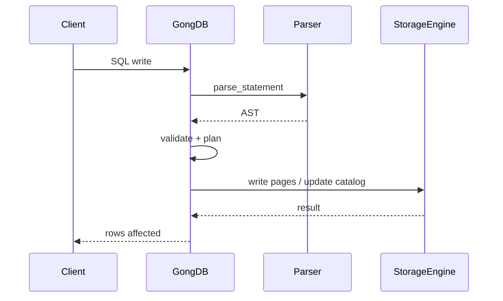
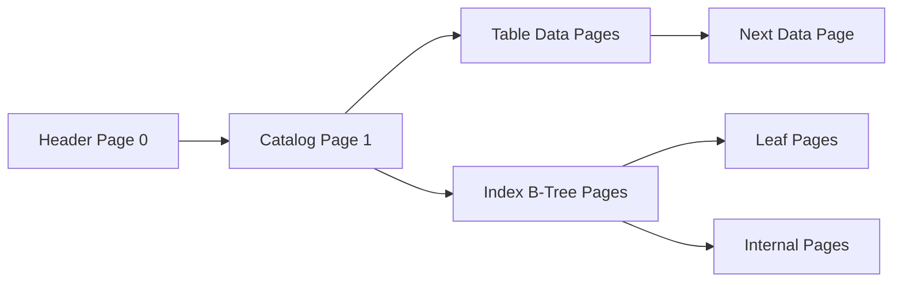

# GongDB Architecture

This document describes the current architecture, design choices, and data flow
for GongDB. It is intended to stay close to the implementation in `src/` and
avoid assumptions that are not yet built.

## Goals And Constraints

- Build a small SQLite-like database from first principles in Rust.
- Keep parsing, execution, and storage modules separated and testable.
- Use `rusqlite` only as an external correctness reference for tests.
- Avoid copying SQLite code or structure.

## Component Map

| Module | Purpose | Key Types |
| --- | --- | --- |
| `src/ast.rs` | SQL syntax tree definitions | `Statement`, `Select`, `Expr`, `TableRef` |
| `src/parser.rs` | Lexer + parser | `parse_statement`, `ParserError` |
| `src/engine.rs` | Planning, execution, and transaction logic | `GongDB`, `QuerySource` |
| `src/storage.rs` | Page-based storage, catalog, indexes | `StorageEngine`, `TableMeta`, `IndexMeta` |

## Component Interaction

## Query Lifecycle

### Parse And Validate

- `parser::parse_statement` converts SQL text into `ast::Statement`.
- Parser errors are formatted with SQLite-like messages in `ParserError`.

### Plan And Execute

`GongDB::run_statement` routes statements through:

1. Transaction handling (`BEGIN`, `COMMIT`, `ROLLBACK`).
2. Statement lock acquisition (read or write).
3. Execution via `execute_statement`.

The executor:
- Resolves table and column scopes.
- Pushes predicates into scans and joins when possible.
- Chooses an index scan when it has a lower estimated cost.
- Applies projection, ordering, grouping, and aggregates.
- Returns a `sqllogictest::DBOutput` for test integration.

### Data Flow Diagram (SELECT)

### Data Flow Diagram (INSERT/UPDATE/DDL)

## Storage Engine

### Page Layout And Catalog

- Fixed page size: `PAGE_SIZE = 65535`.
- Page 0: header (magic, next page id, schema version, catalog format).
- Page 1: catalog page (tables, indexes, views).
- Data pages: table rows stored as page-linked lists.
- B-tree pages: index nodes (leaf and internal).

### Storage Modes

- In-memory: `StorageMode::InMemory` holds a vector of page buffers.
- On-disk: `StorageMode::OnDisk` reads and writes fixed-size pages in a file.

### Journaling And Recovery

- On-disk writes use a `.journal` file.
- Before a page is modified, the original page is written to the journal.
- Startup checks for a journal and restores pages if needed.

### Page Cache

- LRU cache tracks clean and dirty pages.
- Dirty pages are flushed in batches and synchronized to disk.

### Catalog And Metadata

- Catalog stores `TableMeta`, `IndexMeta`, and `ViewMeta`.
- Schema version increments with metadata changes.

### Locking And Concurrency

- A global `LockManager` tracks per-database readers and a single writer.
- `StorageEngine` exposes `acquire_read_lock` and `acquire_write_lock`.
- The engine chooses lock behavior based on transaction isolation.

## Transaction Model

- `BEGIN` creates a storage snapshot and opens a transaction.
- `COMMIT` flushes writes and releases locks.
- `ROLLBACK` restores the snapshot and clears cached stats.
- Isolation levels influence whether a read lock is held for the transaction.

## Query Planning And Execution

### Table And Index Scans

- Table scans iterate data pages via `TableScan`.
- Index scans use B-tree pages to locate row locations and fetch rows.
- A simple cost model selects an index scan when it beats table scan cost.

### Joins And Predicates

- Predicates are collected and assigned to the earliest possible scan.
- Join order is estimated from predicate selectivity and table stats.

### Aggregates And Grouping

- Aggregate expressions are detected and rewritten into aggregate plans.
- Grouping builds per-group rows, then projects aggregate results.

### Subquery Caches

- `SubqueryCache`, `InListCache`, and `InSubqueryCache` avoid repeated work.

## Parser And AST

- `ast.rs` holds the SQL AST data model used across parser, engine, and storage.
- `parser.rs` is a hand-written lexer/parser with SQL error formatting.

## Testing And Verification

- `sqllogictest` drives integration tests from SQLite test files.
- `rusqlite` is used only as a reference result generator in tests.

